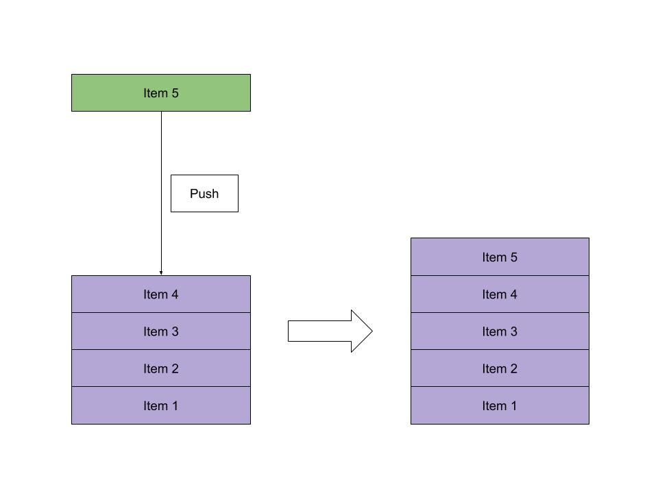

STACK
1.	Introduction: A stack is a data structure that stores items in a Last-In/First-Out (LIFO) or First-In/Last-Out (FILO) manner. This means that an item you put inside of this stack will end up on top and when grabbing data from the list the ithem on top is grabed first hence last in first out. In stack, a new element is added at one end and an element is removed from that end only weather that be the top or the bottom.The stack is nothing but the linear data structure where insertion and deletion take place only at one end.
2.	Last in first out: This is what was descirbed in the intro the item last put into the stack is the first item out of the stack
3.	Types of stack: There are two types of stacks they are register stack and the memory stack. In the memory stack, the stack depth is flexible. It occupies a large amount of memory data, whereas in the register stack only a finite number of memory words will be stored.The register stack is also a memory device present in the memory unit, but it handles only a small amount of data. The stack depth is always limited in the register stack because the size of the register stack s very small compared to the memory.
4.	Applications of stack: A Stack can be used for evaluating expressions consisting of operands and operators. Stacks can be used for Backtracking, i.e., to check parenthesis matching in an expression.It can also be used to convert one form of expression to another form.It can be used for systematic Memory Management.
5.	Push():  stack.append('a') ,stack.append('b') , stack.append('c') this is a fucntion to add items to the stack. You have to specifiy what you want to add inside the () like done earlier. 
6.	Pop(): stack.pop() this is a function to delete an item from the stack. This will delte the last item put into the stack first in last out.
7.	Top(): Returns a reference to the topmost element of the stack stack.top(). The top element will be the last item put in 
8.	isEmpty(): reutrns if the the stack is empty or has any amount of items in it. stack.isEmpty()
9.	size(): This function returns the size of the stack stack.size()
10.	advantages and disadvantages: Advantages of Stack, A Stack helps to manage the data in the ‘Last in First out’ method. When the variable is
not used outside the function in any program, the Stack can be used. It allows you to control and handle memory allocation and deallocation.
It helps to automatically clean up the objects. Disadvantages of Stack It is difficult in Stack to create many objects as it increases the risk of the Stack overflow. It has very limited memory. In Stack, random access is not possible.

    

            class Node:
                """
                Each node of the linked list will have data and links to the 
                previous and next node. 
                """

                def __init__(self, data):
                    """ 
                    Initialize the node to the data provided.  Initially
                    the links are unknown so they are set to None.
                    """
                    self.data = data
                    self.next = None
                    self.prev = None

            def __init__(self):
                """
                Initialize an empty linked list.
                """
                self.head = None
                self.tail = None

            def insert_head(self, value):
                """
                Insert a new node at the front (i.e. the head) of the
                linked list.
                """
                # Create the new node
                new_node = LinkedList.Node(value)  
                
                # If the list is empty, then point both head and tail
                # to the new node.
                if self.head is None:
                    self.head = new_node
                    self.tail = new_node
                # If the list != empty, then only self.head will be
                # affected.
                else:
                    new_node.next = self.head # Connect new node to the previous head
                    self.head.prev = new_node # Connect the previous head to the new node
                    self.head = new_node      # Update the head to point to the new node

            def insert_tail(self, value):
                """
                Insert a new node at the back (i.e. the tail) of the 
                linked list.
                """
                
                temp= LinkedList.Node(value)
                if self.head==None:
                    self.head=temp
                else:
                    curr=self.head
                    while curr.next!=None:
                        curr=curr.next
                    curr.next=temp
                    curr.prev = curr

            def remove_head(self):
                """ 
                Remove the first node (i.e. the head) of the linked list.
                """
                # If the list has only one item in it, then set head and tail 
                # to None resulting in an empty list.  This condition will also
                # cover an empty list.  Its okay to set to None again.
                if self.head == self.tail:
                    self.head = None
                    self.tail = None
                # If the list has more than one item in it, then only self.head
                # will be affected.
                elif self.head != None:
                    self.head.next.prev = None  # Disconnect the second node from the first node
                    self.head = self.head.next  # Update the head to point to the second node
            def remove_tail(self):
                """
                Remove the last node (i.e. the tail) of the linked list.
                """
                try:
                    if self.head==None: # does nothing if the head node is nothing 
                        pass
                    else:
                        curr=self.head #makes the current node = to head
                        prev=None
                        while curr.next!=None: # moves to the next node until it reaches the end
                            prev=curr
                            curr=curr.next
                        prev.next=curr.next
                        del curr
                except:
                    pass

            def insert_after(self, value, new_value):
                """
                Insert 'new_value' after the first occurance of 'value' in
                the linked list.
                """
                # Search for the node that matches 'value' by starting at the 
                # head of the list.
                curr = self.head
                while curr != None:
                    if curr.data == value:
                        # If the location of 'value' is at the end of the list,
                        # then we can call insert_tail to add 'new_value'
                        if curr == self.tail:
                            self.insert_tail(new_value)
                        # For any other location of 'value', need to create a 
                        # new node and reconenct the links to insert.
                        else:
                            new_node = LinkedList.Node(new_value)
                            new_node.prev = curr       # Connect new node to the node containing 'value'
                            new_node.next = curr.next  # Connect new node to the node after 'value'
                            curr.next.prev = new_node  # Connect node after 'value' to the new node
                            curr.next = new_node       # Connect the node containing 'value' to the new node
                        return # We can exit the function after we insert
                    curr = curr.next # Go to the next node to search for 'value'

       
            def remove(self, value):
                """
                Remove the first node that contains 'value'.
                """

                

                # Store head node
                temp = self.head
        
                # If head node itself holds the key to be deleted
                if  temp != None :
                    if  temp.data == value :
                        self.head = temp.next
                        temp = None
                        return
        
                # Search for the key to be deleted, keep track of the
                # previous node as we need to change 'prev.next'
                while temp !=None :
                    if temp.data == value:
                        break
                    prev = temp
                    temp = temp.next
        
                # if key was not present in linked list
                if temp == None :
                    return
        
                # Unlink the node from linked list
                prev.next = temp.next
        
                temp = None

            def replace(self, old_value, new_value):
                """
                Searrch for all instances of 'old_value' and replace the value 
                to 'new_value'.
                """
                temp = self.head
                while temp !=None:
                    if temp.data == old_value:
                        temp.data = new_value
                
                    temp = temp.next

            def __iter__(self):
                """
                Iterate foward through the Linked List
                """
                curr = self.head  # Start at the begining since this is a forward iteration.
                while curr != None:
                    yield curr.data  # Provide (yield) each item to the user
                    curr = curr.next # Go forward in the linked list

            def __reversed__(self):
                """
                Iterate backward through the Linked List
                """
                # initialize variables
                prev = None
                current = self.head
                while current != None:
                    next = current.next
                    current.next = prev # 
                    prev = current
                    current = next
                self.head = prev # makes the end the begining 

                curr = self.head  # Start at the begining since this is a forward iteration.
                while curr != None:
                    yield curr.data  # Provide (yield) each item to the user
                    curr = curr.next # Go forward in the linked list

            def __str__(self):
                """
                Return a string representation of the linked list.
                """
                output = "linkedlist["
                first = True
                for value in self:
                    if first:
                        first = False
                    else:
                        output += ", "
                    output += str(value)
                output += "]"
                return output

# YOUR TURn

ADD CODE TO THIS PROGRAM TO REMOVE A ITEM FROM THE STACK

        class Node:
            def __init__(self, value):
                self.value = value
                self.next = None

        class Stack:

            # Initializing a stack.
            # Use a dummy node, which is
            # easier for handling edge cases.
            def __init__(self):
                self.head = Node("head")
                self.size = 0

            # String representation of the stack
            def __str__(self):
                cur = self.head.next
                out = ""
                while cur:
                    out += str(cur.value) + "->"
                    cur = cur.next
                return out[:-3]

            # Get the current size of the stack
            def getSize(self):
                return self.size

            # Check if the stack is empty
            def isEmpty(self):
                return self.size == 0

            # Get the top item of the stack
            def peek(self):

                # Sanitary check to see if we
                # are peeking an empty stack.
                if self.isEmpty():
                    raise Exception("Peeking from an empty stack")
                return self.head.next.value

            # Push a value into the stack.
            def push(self, value):
                node = Node(value)
                node.next = self.head.next
                self.head.next = node
                self.size += 1

            # Remove a value from the stack and return.
            def pop(self):
                if self.isEmpty():
                    raise Exception("Popping from an empty stack")
                """
                SOLVE HOW OT REMOVE AN ITEM FROM THE STACK
                """

        # Driver Code
        if __name__ == "__main__":
            stack = Stack()
            for i in range(1, 11):
                stack.push(i)
            print(f"Stack: {stack}")

            for _ in range(1, 6):
                remove = stack.pop()
                print(f"Pop: {remove}")
            print(f"Stack: {stack}")
