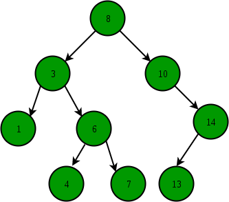

WELCOME
1.	Introduction: This tutorial is on data sturctures 
2.	Contact: Trent-black@hotmail.com

STACK
1.	Introduction: A stack is a data structure that stores items in a Last-In/First-Out (LIFO) or First-In/Last-Out (FILO) manner. This means that an item you put inside of this stack will end up on top and when grabbing data from the list the ithem on top is grabed first hence last in first out. In stack, a new element is added at one end and an element is removed from that end only weather that be the top or the bottom.The stack is nothing but the linear data structure where insertion and deletion take place only at one end.
2.	Last in first out: This is what was descirbed in the intro the item last put into the stack is the first item out of the stack
3.	Types of stack: There are two types of stacks they are register stack and the memory stack. In the memory stack, the stack depth is flexible. It occupies a large amount of memory data, whereas in the register stack only a finite number of memory words will be stored.The register stack is also a memory device present in the memory unit, but it handles only a small amount of data. The stack depth is always limited in the register stack because the size of the register stack s very small compared to the memory.
4.	Applications of stack: A Stack can be used for evaluating expressions consisting of operands and operators. Stacks can be used for Backtracking, i.e., to check parenthesis matching in an expression.It can also be used to convert one form of expression to another form.It can be used for systematic Memory Management.
5.	Push():  stack.append('a') ,stack.append('b') , stack.append('c') this is a fucntion to add items to the stack. You have to specifiy what you want to add inside the () like done earlier. 
6.	Pop(): stack.pop() this is a function to delete an item from the stack. This will delte the last item put into the stack first in last out.
7.	Top(): Returns a reference to the topmost element of the stack stack.top(). The top element will be the last item put in 
8.	isEmpty(): reutrns if the the stack is empty or has any amount of items in it. stack.isEmpty()
9.	size(): This function returns the size of the stack stack.size()
10.	advantages and disadvantages: Advantages of Stack, A Stack helps to manage the data in the ‘Last in First out’ method. When the variable is
not used outside the function in any program, the Stack can be used. It allows you to control and handle memory allocation and deallocation.
It helps to automatically clean up the objects. Disadvantages of Stack It is difficult in Stack to create many objects as it increases the risk of the Stack overflow. It has very limited memory. In Stack, random access is not possible.

    

            class Node:
                """
                Each node of the linked list will have data and links to the 
                previous and next node. 
                """

                def __init__(self, data):
                    """ 
                    Initialize the node to the data provided.  Initially
                    the links are unknown so they are set to None.
                    """
                    self.data = data
                    self.next = None
                    self.prev = None

            def __init__(self):
                """
                Initialize an empty linked list.
                """
                self.head = None
                self.tail = None

            def insert_head(self, value):
                """
                Insert a new node at the front (i.e. the head) of the
                linked list.
                """
                # Create the new node
                new_node = LinkedList.Node(value)  
                
                # If the list is empty, then point both head and tail
                # to the new node.
                if self.head is None:
                    self.head = new_node
                    self.tail = new_node
                # If the list != empty, then only self.head will be
                # affected.
                else:
                    new_node.next = self.head # Connect new node to the previous head
                    self.head.prev = new_node # Connect the previous head to the new node
                    self.head = new_node      # Update the head to point to the new node

            def insert_tail(self, value):
                """
                Insert a new node at the back (i.e. the tail) of the 
                linked list.
                """
                
                temp= LinkedList.Node(value)
                if self.head==None:
                    self.head=temp
                else:
                    curr=self.head
                    while curr.next!=None:
                        curr=curr.next
                    curr.next=temp
                    curr.prev = curr

            def remove_head(self):
                """ 
                Remove the first node (i.e. the head) of the linked list.
                """
                # If the list has only one item in it, then set head and tail 
                # to None resulting in an empty list.  This condition will also
                # cover an empty list.  Its okay to set to None again.
                if self.head == self.tail:
                    self.head = None
                    self.tail = None
                # If the list has more than one item in it, then only self.head
                # will be affected.
                elif self.head != None:
                    self.head.next.prev = None  # Disconnect the second node from the first node
                    self.head = self.head.next  # Update the head to point to the second node
            def remove_tail(self):
                """
                Remove the last node (i.e. the tail) of the linked list.
                """
                try:
                    if self.head==None: # does nothing if the head node is nothing 
                        pass
                    else:
                        curr=self.head #makes the current node = to head
                        prev=None
                        while curr.next!=None: # moves to the next node until it reaches the end
                            prev=curr
                            curr=curr.next
                        prev.next=curr.next
                        del curr
                except:
                    pass

            def insert_after(self, value, new_value):
                """
                Insert 'new_value' after the first occurance of 'value' in
                the linked list.
                """
                # Search for the node that matches 'value' by starting at the 
                # head of the list.
                curr = self.head
                while curr != None:
                    if curr.data == value:
                        # If the location of 'value' is at the end of the list,
                        # then we can call insert_tail to add 'new_value'
                        if curr == self.tail:
                            self.insert_tail(new_value)
                        # For any other location of 'value', need to create a 
                        # new node and reconenct the links to insert.
                        else:
                            new_node = LinkedList.Node(new_value)
                            new_node.prev = curr       # Connect new node to the node containing 'value'
                            new_node.next = curr.next  # Connect new node to the node after 'value'
                            curr.next.prev = new_node  # Connect node after 'value' to the new node
                            curr.next = new_node       # Connect the node containing 'value' to the new node
                        return # We can exit the function after we insert
                    curr = curr.next # Go to the next node to search for 'value'

       
            def remove(self, value):
                """
                Remove the first node that contains 'value'.
                """

                

                # Store head node
                temp = self.head
        
                # If head node itself holds the key to be deleted
                if  temp != None :
                    if  temp.data == value :
                        self.head = temp.next
                        temp = None
                        return
        
                # Search for the key to be deleted, keep track of the
                # previous node as we need to change 'prev.next'
                while temp !=None :
                    if temp.data == value:
                        break
                    prev = temp
                    temp = temp.next
        
                # if key was not present in linked list
                if temp == None :
                    return
        
                # Unlink the node from linked list
                prev.next = temp.next
        
                temp = None

            def replace(self, old_value, new_value):
                """
                Searrch for all instances of 'old_value' and replace the value 
                to 'new_value'.
                """
                temp = self.head
                while temp !=None:
                    if temp.data == old_value:
                        temp.data = new_value
                
                    temp = temp.next

            def __iter__(self):
                """
                Iterate foward through the Linked List
                """
                curr = self.head  # Start at the begining since this is a forward iteration.
                while curr != None:
                    yield curr.data  # Provide (yield) each item to the user
                    curr = curr.next # Go forward in the linked list

            def __reversed__(self):
                """
                Iterate backward through the Linked List
                """
                # initialize variables
                prev = None
                current = self.head
                while current != None:
                    next = current.next
                    current.next = prev # 
                    prev = current
                    current = next
                self.head = prev # makes the end the begining 

                curr = self.head  # Start at the begining since this is a forward iteration.
                while curr != None:
                    yield curr.data  # Provide (yield) each item to the user
                    curr = curr.next # Go forward in the linked list

            def __str__(self):
                """
                Return a string representation of the linked list.
                """
                output = "linkedlist["
                first = True
                for value in self:
                    if first:
                        first = False
                    else:
                        output += ", "
                    output += str(value)
                output += "]"
                return output

SET
1.	Introduction: In Python, a Set is an unordered collection of data types that is iterable, mutable and has no duplicate elements. The order of elements in a set is undefined though it may consist of various elements. Sets can be created by using the built-in set() function 
2.	Internal working of Set: If Multiple values are present at the same index position, then the value is appended to that index position, to form a Linked List. In, CPython Sets are implemented using dictionary with dummy variables, where key beings the members set with greater optimizations to the time complexity.
3.	Adding elements, add(): Elements can be added to the Set by using the built-in add() function. Only one element at a time can be added to the set by using add() method, loops are used to add multiple elements at a time with the use of add() method.
4.	Copy(): set_name.copy(), The copy() method returns a shallow copy of the set in python. The copy() method for sets doesn’t take any parameters
5.	Operators for Sets: Intersection , Union, and Difference
6.	Union: Two sets can be merged using union() function or | operator. Both Hash Table values are accessed and traversed with merge operation perform on them to combine the elements, at the same time duplicates are removed.
7.	Intersection: This can be done through intersection() or & operator. Common Elements are selected. They are similar to iteration over the Hash lists and combining the same values on both the Table.
8.	Difference: To find difference in between sets. Similar to find difference in linked list. This is done through difference()
9.	Clearing sets clear():  set_name.clear(), The clear() method doesn't take any parameters. The clear() method doesn't return any value. clear() method to remove all the elements of the set so it will then be blank.
10.	Time complexity of Sets:  O(1) on average. However in worst case it can become O(n).
11.	Pros and cons: The major advantage of using a set, as opposed to a list, is that it has a highly optimized method for checking whether a specific element is contained in the set.

        def intersection(set1, set2):
            """
            Perform an intersection between 2 sets.  An intersection will contain
            the items in common between both sets.  Do not use the set 
            operators (+, -, *, &, |) and functions (intersection, union) 
            that are built-in to Python.
            """

            

            inters = []

            for num in set1: # if the item in set1 is equal to any items in set2 
                for item in set2:
                    if num == item:
                        inters.append(num)
            return inters

        def union(set1, set2):
            """
            Perform a union between 2 sets.  A union will contain all the items
            from both sets.   Do not use the set operators (+, -, *, &, |)
            and functions (intersection, union) that are built-in to Python.
            """

            lst = list(set1) 
            for item in set2: 
                if item not in lst: 
                    lst.append(item) 
                                        #this will not take any repeated vaules 
            

            return lst

        s1 = {1,2,3,4,5}
        s2 = {4,5,6,7,8}
        print(intersection(s1,s2))  # Should show {4, 5}
        print(union(s1,s2)) # Should show {1, 2, 3, 4, 5, 6, 7, 8}

        s1 = {1,2,3,4,5}
        s2 = {6,7,8,9,10}
        print(intersection(s1,s2))  # Should show an empty set
        print(union(s1,s2)) # Should show {1, 2, 3, 4, 5, 6, 7, 8, 9, 10}

        ----------------------------------------------------------------------
        def find_pairs(words):
        """
        The words parameter contains a list of two character 
        words (lower case, no duplicates). Using sets, find an O(n) 
        solution for displaying all symmetric pairs of words.  

        For example, if words was: [am, at, ma, if, fi], we would display:

        am & ma
        if & fi

        The order of the display above does not matter.  'at' would not 
        be displayed because 'ta' is not in the list of words.

        As a special case, if the letters are the same (example: 'aa') then
        it would not match anything else (remember no the assumption above
        that there were no duplicates) and therefore should not be displayed.
        """ 
    
        words = set(words) # creates a set using the words or letters given below 
        pairs = set() # will hold the pairs of words 

        for char in words: # for the characters in the words get the reverse of the way they came in 
            reverse = char[::-1]
            if reverse < char:
                pair = (reverse, char)
            else:
                pair = (char, reverse)
            
        
            if reverse in words:
                pairs.add(pair) 
            
        for x,y in pairs:
            if x !=y:
                print(x,"&",y) # this way only the number s and letter combinations below come out
                # this could be printed with out this last bit
    
        
    

    find_pairs(["am","at","ma","if","fi"])      # ma & am, fi & if
    print("=============")
    find_pairs(["ab", "bc", "cd", "de", "ba"])  # ba & ab
    print("=============")
    find_pairs(["ab","ba","ac","ad","da","ca"]) # ba & ab, da & ad, ca & ac
    print("=============")
    find_pairs(["ab", "ac"])                    # None
    print("=============")
    find_pairs(["ab", "aa", "ba"])              # ba & ab
    print("=============")
    find_pairs(["23","84","49","13","32","46","91","99","94","31","57","14"])
                                                # 32 & 23, 94 & 49, 31 & 13

TREE
1.	Introduction: a treee or a bst tree is a way of spliting numbers by largest to smallest. Largest go to the right and smallest go to the left. It is a tree beause every node has two branches(children) underneateh them the right is bigger then the one on the left.
2.	When to use a Tree: When to Use Binary Search Trees. Implementing a binary search tree is useful in any situation where the elements can be compared in a less than / greater than manner
3.	 Root Node: root node is the starting node. This is where the first item added to the tree goes. IF a bst tree is created from a list than the item closet to the median of the list becomes the root.
4.	Parent Node: a parent node is the first nodes off the root node
5.	child: the child node is the first nodes of the parent nodes.
6.	Degree of a Node: thios is the Height of the node it could be 
10.	Sibling: sibling nodes are nodes that are underneat the same node 

    

            class add :
                @staticmethod
                def main( args) :
                    tree = BST()
                    tree.insert(30)
                    tree.insert(50)
                    tree.insert(15)
                    tree.insert(20)
                    tree.insert(10)
                    tree.insert(40)
                    tree.insert(60)
                    tree.inorder()
            class Node :
                left = None
                val = 0
                right = None
                def __init__(self, val) :
                    self.val = val
            class BST :
                root = None
                def insert(self, key) :
                    node = Node(key)
                    if (self.root == None) :
                        self.root = node
                        return
                    prev = None
                    temp = self.root
                    while (temp != None) :
                        if (temp.val > key) :
                            prev = temp
                            temp = temp.left
                        elif(temp.val < key) :
                            prev = temp
                            temp = temp.right
                    if (prev.val > key) :
                        prev.left = node
                    else :
                        prev.right = node
                def inorder(self) :
                    temp = self.root
                    stack =  []
                    while (temp != None or not (len(stack) == 0)) :
                        if (temp != None) :
                            stack.append(temp)
                            temp = temp.left
                        else :
                            temp = stack.pop()
                            print(str(temp.val) + " ", end ="")
                            temp = temp.right
                
            if __name__=="__main__":
                add.main([])

